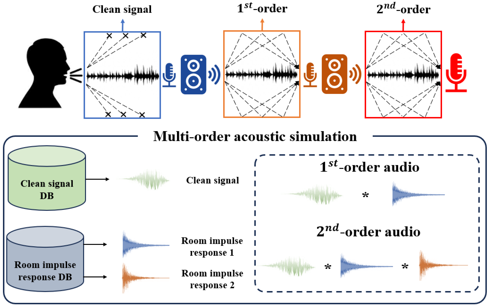

# A Pre-Training Framework Based on Multi-Order Acoustic Simulation for Replay Voice Spoofing Detection

# Introduction

This repository provides a PyTorch implementation of speaker recognition framework

# Dependencies

- Python3
- Numpy
- PyTorch
- librosa
- tqdm
- torchaudio
